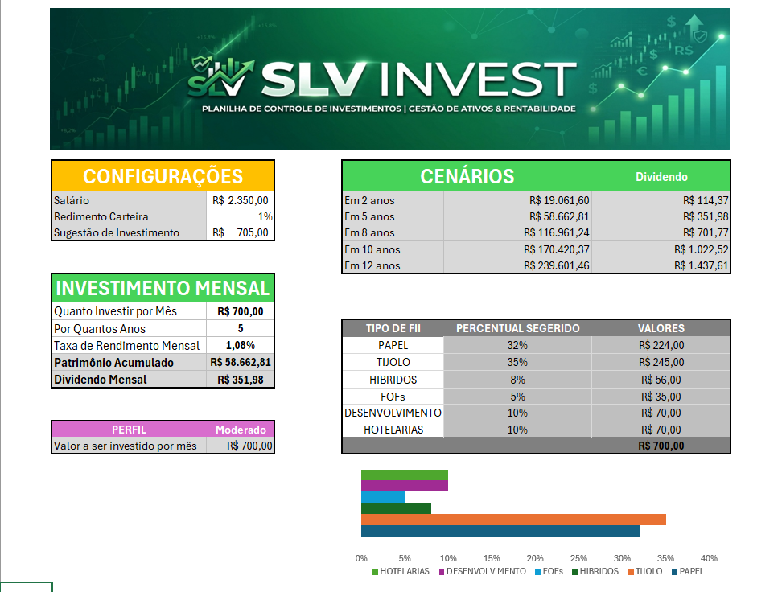

# 📊 SLV Invest — Planilha de Controle de Investimentos

## 📌 Sobre o projeto

O **SLV Invest** é uma ferramenta desenvolvida em Microsoft Excel para auxiliar no planejamento e na simulação de investimentos em Fundos de Investimento Imobiliário (FIIs).

A planilha permite que o usuário informe seus principais parâmetros financeiros e simule diferentes cenários de investimento, apresentando uma projeção do patrimônio acumulado e dos dividendos mensais.

Além da simulação financeira, a ferramenta também apresenta uma sugestão de distribuição do investimento mensal entre diferentes tipos de FIIs, de acordo com o perfil selecionado pelo usuário.

O projeto foi desenvolvido como parte de um desafio prático de Excel, com foco na aplicação de cálculos financeiros, funções do Excel, organização de dados, automação de cálculos e apresentação visual das informações.

---

## 🎯 Objetivos

- Criar uma ferramenta prática para simulação de investimentos;
- Aplicar conceitos de Excel e cálculos financeiros;
- Automatizar cálculos de patrimônio acumulado;
- Estimar dividendos mensais;
- Simular diferentes períodos de investimento;
- Permitir a definição de diferentes taxas de rendimento;
- Sugerir uma distribuição dos investimentos de acordo com o perfil do investidor;
- Apresentar os resultados de forma clara e organizada;
- Documentar o projeto utilizando o GitHub.

---

## ⚙️ Funcionalidades

### 💰 Configurações

A ferramenta permite configurar:

- Salário mensal;
- Rendimento da carteira;
- Sugestão de investimento mensal.

A sugestão de investimento é calculada automaticamente com base no salário informado.

---

### 📈 Simulação de investimento mensal

O usuário pode definir:

- Valor a investir por mês;
- Quantidade de anos do investimento;
- Taxa de rendimento mensal.

Com essas informações, a ferramenta calcula automaticamente:

- Patrimônio acumulado;
- Dividendo mensal estimado.

---

### 📊 Cenários de investimento

A planilha apresenta projeções para diferentes períodos:

- 2 anos;
- 5 anos;
- 8 anos;
- 10 anos;
- 12 anos.

Para cada período, são apresentados:

- Patrimônio projetado;
- Estimativa de dividendos mensais.

Isso permite comparar a evolução do investimento ao longo do tempo.

---

## 👤 Perfis de investimento

A ferramenta possui três perfis de investimento:

### 🟢 Conservador

Perfil com uma distribuição mais concentrada em FIIs de Papel e Tijolo.

| Tipo de FII | Percentual |
|---|---:|
| PAPEL | 30% |
| TIJOLO | 50% |
| HÍBRIDOS | 10% |
| FOFs | 10% |
| DESENVOLVIMENTO | 0% |
| HOTELARIAS | 0% |

### 🟡 Moderado

Perfil com uma distribuição mais equilibrada entre diferentes tipos de FIIs.

| Tipo de FII | Percentual |
|---|---:|
| PAPEL | 32% |
| TIJOLO | 35% |
| HÍBRIDOS | 8% |
| FOFs | 5% |
| DESENVOLVIMENTO | 10% |
| HOTELARIAS | 10% |

### 🔴 Agressivo

Perfil com maior exposição a categorias de maior potencial de crescimento.

| Tipo de FII | Percentual |
|---|---:|
| PAPEL | 50% |
| TIJOLO | 10% |
| HÍBRIDOS | 5% |
| FOFs | 5% |
| DESENVOLVIMENTO | 20% |
| HOTELARIAS | 10% |

---

## 🏢 Distribuição do investimento

Após selecionar o perfil, a ferramenta calcula automaticamente o valor destinado a cada tipo de FII com base no valor do aporte mensal.

Os tipos de FIIs considerados são:

- **Papel**
- **Tijolo**
- **Híbridos**
- **FOFs**
- **Desenvolvimento**
- **Hotelarias**

Dessa forma, o usuário consegue visualizar tanto o percentual sugerido quanto o valor correspondente de cada categoria.

---

## 🧮 Exemplo de simulação

Como exemplo, foi realizada uma simulação utilizando o perfil **Moderado**.

### Configurações

| Parâmetro | Valor |
|---|---:|
| Salário | R$ 2.350,00 |
| Rendimento da carteira | 0,60% |
| Sugestão de investimento | R$ 705,00 |
| Investimento mensal | R$ 700,00 |
| Taxa de rendimento mensal | 1,08% |
| Período | 5 anos |
| Perfil | Moderado |

### Resultado

Para um investimento mensal de **R$ 700,00**, durante 5 anos, com rendimento mensal de **1,08%**, a simulação apresentada na ferramenta resulta em:

- **Patrimônio acumulado:** R$ 58.662,81
- **Dividendo mensal estimado:** R$ 351,98

### Cenários projetados

| Período | Patrimônio acumulado | Dividendo mensal |
|---|---:|---:|
| 2 anos | R$ 19.061,60 | R$ 114,37 |
| 5 anos | R$ 58.662,81 | R$ 351,98 |
| 8 anos | R$ 116.961,24 | R$ 701,77 |
| 10 anos | R$ 170.420,37 | R$ 1.022,52 |
| 12 anos | R$ 239.601,46 | R$ 1.437,61 |

---

## 📷 Demonstração

### Simulação — Perfil Moderado



A imagem acima apresenta o dashboard da ferramenta com a simulação configurada para o perfil **Moderado**, demonstrando os principais indicadores, cenários de investimento e distribuição sugerida entre os tipos de FIIs.

---

## 🧠 Principais recursos do Excel utilizados

Durante o desenvolvimento da ferramenta foram utilizados recursos de Excel para automatizar os cálculos e relacionar os dados de acordo com o perfil selecionado.

Entre os recursos utilizados estão:

- Fórmulas financeiras;
- Cálculo de valor futuro;
- Cálculo de dividendos;
- Procura e relacionamento de informações;
- Percentuais;
- Referências entre células;
- Tabelas de apoio;
- Validação e seleção de perfil;
- Gráficos para visualização dos dados;
- Formatação condicional e formatação personalizada.
---

## 🛠️ Tecnologias utilizadas

- **Microsoft Excel** — Desenvolvimento da ferramenta e realização dos cálculos;
- **GitHub** — Versionamento e compartilhamento do projeto;
- **Markdown** — Documentação do projeto.

---

## 📁 Estrutura do projeto

```text
simulador-investimentos-fii/
│
├── README.md
├── Simulador_Investimentos_FII.xlsx
│
└── images/
    └── Simulação_Moderado.png
    └── Simulação_Agressivo.png
    └── Simulação_Conservador.png
    └── Tabela_de_Apoio.png


⚠️ Aviso

Este projeto possui finalidade educacional e de simulação.

Os valores apresentados são projeções baseadas nos parâmetros informados na planilha e não representam garantia de rentabilidade futura ou recomendação de investimento.


👨‍💻 Autor

Eduardo Silva

Projeto desenvolvido como parte de um desafio prático de Excel, com foco em simulação de investimentos, cálculos financeiros e documentação técnica.
